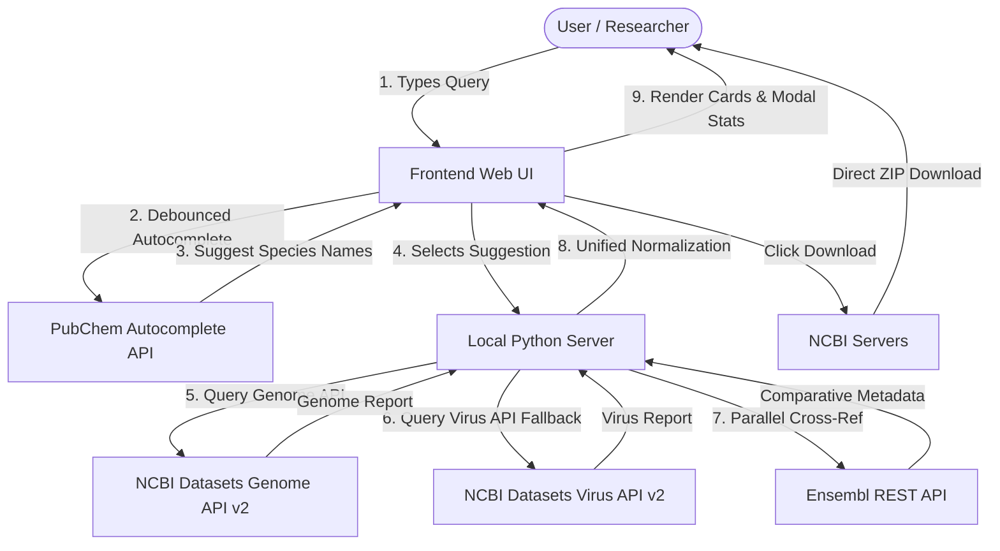

# Reference Genome Fetcher - Web Application
A high-fidelity, zero-dependency bioinformatics web application built with a Python backend and a modern glassmorphic web interface. It allows researchers and students to query, explore, and download official reference genomes and alternative sequenced assemblies (clinical isolates, strains, and cancer cell lines) from the **National Center for Biotechnology Information (NCBI)** and **Ensembl** databases.
---
## 🔬 Scientific Context & Project Scope
In modern genomics and bioinformatics, analyzing genomic variation is critical to understanding disease, mutation rates, and evolutionary pathways. This application is designed to support two main areas of genomic research:
### 1. Reference Genomes vs. Variant Isolates
* **Reference Genomes**: A reference genome (e.g., GRCh38 for humans) is a representative digital sequence of an organism's genome. It acts as a standard coordinate system and gold standard for sequence alignment, annotation, and mapping.
* **Alternative Isolates & Strains**: To study mutations, drug resistance, or pathogenicity, researchers must compare sequence data against the reference genome.
  * *Example (Plasmodium falciparum)*: Malaria research relies on comparing different sequenced strains (like `3D7` vs. chloroquine-resistant `Dd2` or `W2`) to map mutations in the *pfcrt* gene that cause drug resistance.
  * *Example (Cancer Genomics)*: Comparing reference genomes to the sequenced genomes of cancer cell lines (or tumors) reveals somatic mutations, insertions/deletions (indels), and structural variants driving cancer progression.
  * *Toggle functionality*: By turning off the **"Reference Genomes Only"** filter, this application fetches all recorded assemblies for a taxon, giving researchers access to these clinical isolates and mutated strains.
### 2. Eukaryotes, Prokaryotes, and Viruses
NCBI structures genome data differently depending on the domain of life:
* **Eukaryotes & Prokaryotes** are cataloged in the NCBI Assembly database (accessed via `/genome` API routes), which tracks karyotypes, chromosomes, contigs, and assembly levels (chromosome, complete genome, scaffold, contig).
* **Viruses** (e.g., *Coronavirus*, *Hepatitis B virus*) have compact genomes that are tracked in the NCBI Nucleotide database (accessed via `/virus` API routes). They lack traditional eukaryotic "assemblies" but are categorized by completeness, source databases, and Pangolin lineages.
* *Fallback logic*: This application automatically queries the genome database first. If no records are found, it queries the virus database, normalizing the results into a single, cohesive user interface.
---
## 🚀 Advanced Features
### 1. PubChem Taxonomy Autocomplete Search
Broad common names like "coronavirus" or "hepatitis" do not map directly to a single assembly on NCBI. To prevent searches from returning empty results:
* An **autocomplete dropdown** is built directly into the search bar.
* As the user types, the application queries the PubChem Taxonomy Autocomplete API to fetch matching official species, strains, or lineages (e.g. *Hepatitis B virus*, *Severe acute respiratory syndrome coronavirus 2*).
* Selecting a suggestion automatically inserts it and runs the search, guaranteeing that NCBI matches and returns valid genomes.
### 2. Genome Assembly Quality Metrics (Contig & Scaffold N50)
For eukaryotic and prokaryotic assemblies, the details modal displays key assembly quality statistics:
* **Contig N50**: A statistical measure of assembly continuity. It represents the length of the shortest contig such that all contigs of that length or longer cover 50% of the assembled genome. A higher N50 indicates a more complete and contiguous assembly (higher quality).
* **Scaffold N50**: Similar to Contig N50, but calculated using scaffolds (which can span sequence gaps).
* **Contig & Scaffold Counts**: Shows the number of components. Lower counts usually indicate a higher-quality, chromosome-level assembly.
* **Ungapped Length**: Compares total sequenced bases excluding gap spacers.
### 3. Ensembl Database Cross-Referencing
For Eukaryotes, the local Python server queries the **Ensembl REST API** in parallel with NCBI. If Ensembl holds matching records, the details modal renders a comparative metadata section displaying:
* Ensembl Assembly Name (e.g., `GRCh38.p14`)
* Assembly Release Date
* Genebuild Method (e.g., `Annotation of NCBI RefSeq assembly...`)
* Last Genebuild Update Date
* Assembly Authority
### 4. Reactive Filtering
The "Reference Genomes Only" toggle switch triggers a live search update. Flipping the switch automatically re-submits the search query, updating the UI dynamically without needing a manual search submission.
---
## 🏗️ System Architecture
The application is structured as a lightweight, single-page application (SPA) backed by a custom proxy server. 

---
## 🛠️ Technology Stack
1. **Backend**:
   - **Python (3.x)**: Uses only Python's built-in standard libraries (`http.server`, `urllib.request`, `urllib.parse`, and `json`).
   - **Zero-Dependency**: No virtual environments (`venv`) or package installations (`pip install`) are required, bypassing dependency issues or network firewalls.
2. **Frontend**:
   - **HTML5**: Structured semantic layout with custom modal overlay containers.
   - **CSS3 (Vanilla)**: Centered layout with glassmorphic elements, glowing visual accents, and subtle animations. Incorporates Google Fonts ("Outfit" and "Fira Code").
   - **JavaScript (Vanilla)**: Handles async API calls, coordinates debounced autocomplete, keyboard selections (Arrow Up/Down + Enter), and normalizes genome statistics.
---
## 🚀 Running the Application
### Prerequisites
* Python 3.10 or higher installed.
### Step-by-Step Launch
1. Clone or download the repository to your local workspace.
2. Open a terminal in the root project folder and run the server:
   ```bash
   python server.py
   ```
3. Open your browser and navigate to:
   [http://localhost:3000](http://localhost:3000)
### (Optional) Adding an NCBI API Key
By default, the NCBI Datasets API limits requests to 5 per second. You can increase this to 10 per second by setting your NCBI API key as an environment variable before starting the server.
* **On Windows (PowerShell)**:
  ```powershell
  $env:NCBI_API_KEY="your_api_key_here"
  python server.py
  ```
* **On macOS / Linux**:
  ```bash
  export NCBI_API_KEY="your_api_key_here"
  python server.py
  ```
---
## 🧬 Scientific Queries
To demonstrate the application's capabilities, try the following queries:
1. **Querying a Reference Eukaryotic Genome**:
   * *Search*: `Homo sapiens` (Reference Genomes Only: Checked)
   * *Outcome*: Retrieves the official reference genome (GRCh38.p14) with a size of `3.10 Gb` and 24 chromosomes. In the details modal, check the **Assembly Quality Metrics** (Contig N50: `57.88 Mb`) and the **Ensembl Database Cross-Reference** section.
2. **Comparative Genomics (Non-Reference Strains)**:
   * *Search*: `Plasmodium falciparum` (Reference Genomes Only: **Unchecked**)
   * *Outcome*: Retrieves over 70 sequenced strains (like `W2` and `PfDd2-3`). Researchers use these alternative assemblies to identify specific point mutations that confer resistance to antimalarial drugs.
3. **Querying Viral Pathogens (Automatic Autocomplete & Fallback)**:
   * *Search*: Type `coronavirus` in the search bar. Select `Severe acute respiratory syndrome coronavirus 2` from the dropdown list.
   * *Outcome*: The application automatically falls back to the virus API, returns completeness metrics (e.g. `COMPLETE`), and links directly to the NCBI Nucleotide (`nuccore`) record
